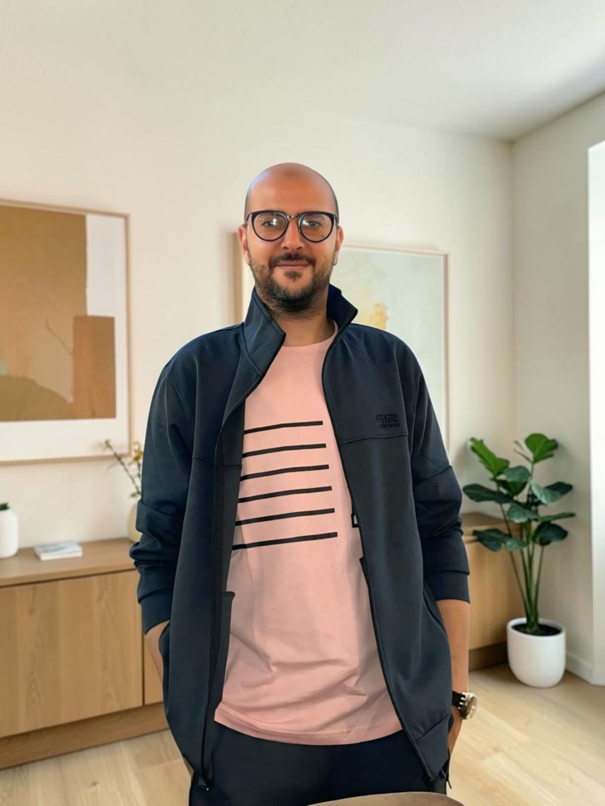

# Hi 👋 I'm Mohammed Elgabry

### Front-End Developer | React.js | TypeScript | Tailwind CSS | Strapi | REST APIs

Passionate about building modern, scalable, and responsive web applications using the React ecosystem.
Currently focused on TypeScript, clean architecture, and real-world business applications.

---

# 👨‍💻 About Me

- 💻 Front-End Developer from Egypt 🇪🇬
- ⚛️ Specialized in React.js Development
- 📘 Currently mastering TypeScript
- 🏗️ Building a CRM System with React + TypeScript
- 🧠 Interested in Clean Architecture & Scalable Applications
- 🚀 Looking for Junior Front-End Developer opportunities
- ❤️ I enjoy transforming business ideas into real products

---

# 🚀 Tech Stack

### Frontend

### State Management

Zustand

### Backend & APIs

REST API • Strapi CMS

### Tools

---

# 📌 Featured Projects

## 📚 Book Shop

A complete Full-Stack E-Commerce web application built with React and Strapi.

### Features

- Authentication
- Shopping Cart
- Wishlist
- Checkout
- Orders
- User Profiles
- Seller Dashboard
- Admin Dashboard
- Payment Integration
- Responsive Design

### Tech Stack

React • TypeScript • Tailwind CSS • Zustand • Strapi • REST APIs

### Repository

Frontend

https://github.com/MOhammed-ELgabry/Book-Shop

Backend

https://github.com/MOhammed-ELgabry/1stpro-backend

---

## 🌐 Personal Portfolio

Modern portfolio website built using React and Tailwind CSS.

### Live Demo

https://my-portfolio-black-delta-33.vercel.app

### Repository

https://github.com/MOhammed-ELgabry/my-portfolio

---

## ⚽ Pro Player (Work in Progress)

Football players platform.

### Planned Features

- Authentication
- Player Profiles
- Video Upload
- Search & Filters
- Responsive UI

### Tech

React

TypeScript

Tailwind CSS

Zustand

Strapi

---

# 📈 Current Goals

- ✅ Master TypeScript
- 🚀 Build Enterprise CRM
- 📚 Learn Advanced React Patterns
- ⚡ Improve Performance Optimization
- 💼 Land my first Front-End Developer role

---

# 📊 GitHub Stats

---

# 🔥 GitHub Streak

---

# 🏆 GitHub Trophies

---

# 🌍 Connect With Me

- 💼 LinkedIn  
  https://www.linkedin.com/in/mohammed-elgabry-94b052326

- 🌐 Portfolio  
  https://my-portfolio-black-delta-33.vercel.app

- 📧 Email  
  mohammedelgabry187@gmail.com

---

### ⭐ Thanks for visiting my profile!

If you like my projects, don't forget to leave a ⭐ on the repositories.

